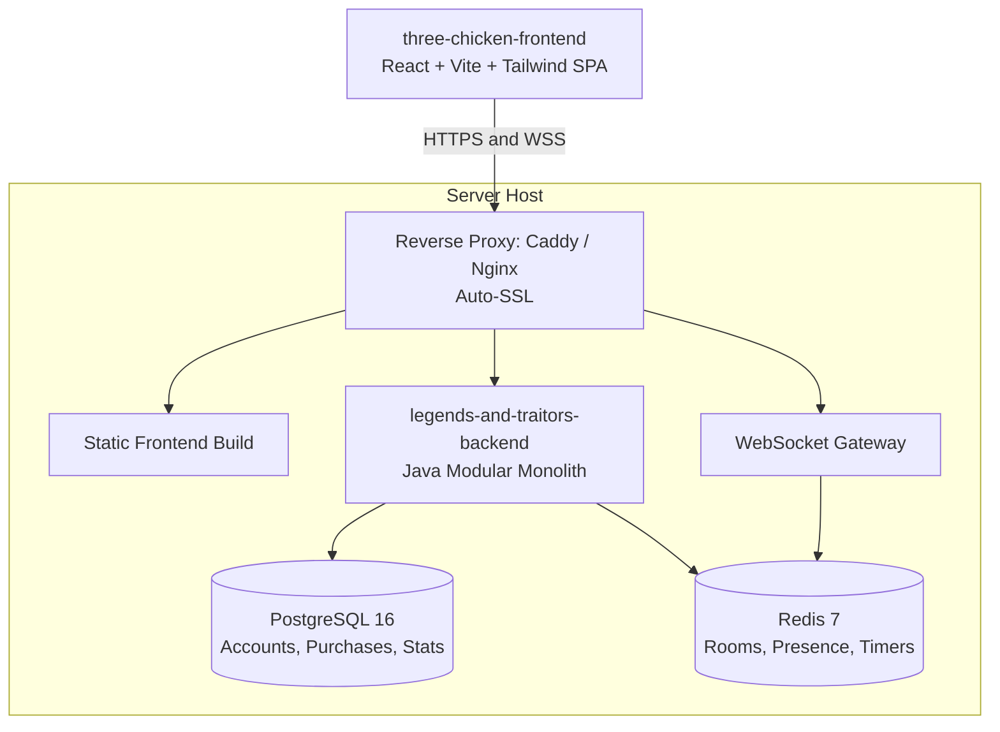

# CLAUDE.md

Guidance for Claude Code when working in `legends-and-traitors-backend`.

> **How to maintain this file:** Sections are numbered and independent — extend or replace one
> without touching the others. Facts marked **(repo-verified)** were read from code and must be
> re-checked when the code changes. Facts marked **(spec)** come from design docs and describe
> intended behaviour that may not be built yet. See §11 for the update checklist.
>
> **Unresolved items** are marked inline as **[OPEN-nn]** and indexed in **§12**. Run
> `grep -n "OPEN-" CLAUDE.md` to list every open point. Do not treat an `[OPEN-nn]` value as
> settled — if you need one to write code, ask rather than pick. Delete the marker and the §12
> row together when it is decided.

---

## 1. Project Overview

- **Project**: Three Chicken (working title *Legends and Traitors*)
- **This repo**: `legends-and-traitors-backend` — Java modular monolith, server-authoritative
- **Companion repo**: `three-chicken-frontend` — React 18/19 + Vite + TypeScript + TailwindCSS,
  Zustand (WS/session state), Framer Motion (card animations), Howler.js (audio),
  `@stomp/stompjs` client with auto-reconnect
- **Genre**: Real-time multiplayer social deduction + tactical turn-based card battle
- **Inspirations**: *Bang!*, *SanGuoSha (Legends of the Three Kingdoms)*, *Werewolf/Mafia*

### 1.1 Core Loop (spec)

1. Players enter a lobby (guest or registered) via room code or direct URL.
2. Server distributes 4 secret roles; the King's identity is publicly revealed.
3. Draft phase — each player selects a historical/mythological Hero.
4. Clockwise real-time turn combat: Attacks, Spells, Equipment, Healing.
5. Targeted players get a tight **10–15s response window** to react (*Dodge*, *Medicine*).
6. Match ends when King/Loyalists, Rebels, or the solo Spy meet victory conditions.

### 1.2 External Resources

- **Miro planning board**: https://miro.com/app/board/uXjVHtdGyfY=/ (game design canvas)
- **Project tracker**: https://taiga.io — agile scrum epics & user stories (`LT-` ticket IDs)
- **Engineering wiki**: Notion — source of truth for epics and specs

### 1.3 Non-Functional Targets (spec)

- Real-time board-state propagation to all clients: **< 1.0s**
- High-concurrency WebSocket sessions served on **virtual threads**, not blocking kernel threads

---

## 2. Tech Stack

| Component | Technology | Version | Notes |
| --- | --- | --- | --- |
| Language | Java | **21 LTS** (repo-verified: `java.version=21`) | Virtual Threads, strict typing for card mechanics |
| Framework | Spring Boot | **4.1.1** (repo-verified: parent POM) | Design docs say "3.x/4.x"; the POM pins 4.1.1 |
| Primary DB | PostgreSQL | 16-alpine (repo-verified) | Accounts, credentials, $1 upgrade transactions |
| Cache / real-time | Redis | 7-alpine (repo-verified) | Room state, presence, session TTLs, pub/sub |
| Real-time gateway | **STOMP** over Spring WebSocket | starter present (repo-verified); broker not yet configured | Lobby sync, action alerts, live action log — see §7.2 |
| Persistence | Spring Data JPA | via starter (repo-verified) | `open-in-view: false` on every profile |
| Build | Apache Maven | wrapper `./mvnw` (repo-verified) | Maven 3.9+ |
| Codegen | Lombok | optional dep + annotation processor paths (repo-verified) | `@Getter`/`@Setter` used in config classes |

Test starters present (repo-verified): `data-jpa-test`, `data-redis-test`, `webmvc-test`, `websocket-test`.

- **Maven coordinates** (repo-verified): `com.seproduction:legends-and-traitors-backend:0.0.1-SNAPSHOT`

---

## 3. Commands

```bash
# Start local PostgreSQL 16 + Redis 7
docker compose -f docker-compose.dev.yml up -d

# Run the app (defaults to the dev profile)
./mvnw spring-boot:run

# Build / test
./mvnw clean test --batch-mode
./mvnw clean package

# Run against a non-default profile
./mvnw spring-boot:run -Dspring-boot.run.profiles=test
```

On Windows PowerShell use `.\mvnw.cmd` in place of `./mvnw`; the POSIX wrapper works in Git Bash,
WSL, and CI.

**Local ports** (repo-verified from `docker-compose.dev.yml` + `application.yml`):

| Service | Address | Credentials |
| --- | --- | --- |
| Spring Boot app | `http://localhost:8080` | — |
| PostgreSQL 16 | `localhost:5432` | db `three_chicken`, user `dev`, password `devpassword` |
| Redis 7 | `localhost:6379` | — |

Containers are named `tc-postgres-dev` / `tc-redis-dev`; both have healthchecks and named volumes
(`postgres_data`, `redis_data`).

---

## 4. Architecture — ADR-001: Progressive Feature-First

**Status:** Approved 2026-09-07 by Backend Engineering Team + Platform Lead.
**Base package (canonical):** `com.seproduction.legendsandtraitors` (repo-verified).

> **Known doc drift:** `Backend structure.md` shows the base package as `com.threechicken.game`.
> That is **stale** — ADR-001 and the code both use `com.seproduction.legendsandtraitors`.

### 4.1 The Rule: "Start Flat, Layer As It Grows"

A feature package starts **flat** (all its files directly inside the domain package). It is broken
into the standard sub-packages only once complexity justifies it. This deliberately avoids empty
folder boilerplate in young features.

### 4.2 Refactoring Triggers — sub-layer when ANY of these hit

1. **File-count threshold** — the feature exceeds **5–7 files**.
2. **Dual-protocol trigger** — the feature has **both** REST endpoints and WebSocket handlers.
3. **Model complexity** — entities plus multiple request/response DTOs need their own `model/`
   (or `dto/`) sub-package.

> ⚠️ **[OPEN-01]** ADR-001 §3.2 writes "`model/` (or `dto/`)", but §4.3 mandates exact names and
> lists only `model/`. Decide: `model/` only, or `model/` for entities + a sibling `dto/` for
> wire types. Affects every sub-layered feature.

### 4.3 Standard Sub-Package Names (use these exact names, always)

`controller/` · `handler/` · `service/` · `repository/` · `model/`

- `controller/` — REST endpoints
- `handler/` — STOMP message controllers (`@MessageMapping`) and WS event payloads
- `service/` — business rules
- `repository/` — persistence (JPA or Redis)
- `model/` — entities and DTOs

### 4.4 Inter-Feature Boundary Rules (strict)

- Features talk to each other **only** through public **service interfaces** or **IDs/DTOs**.
- **Never** import another feature's repositories or internal entities directly.
- Prefer Java **package-private** visibility for a feature's internal components.

### 4.5 Target Layout

```
com.seproduction.legendsandtraitors/
├── LegendsAndTraitorsBackendApplication.java
│
├── config/              <-- Global Spring beans (Cors, StompBrokerConfig, Redis, Database, properties)
├── common/              <-- Shared utils, base exceptions, global error handlers
├── security/            <-- JWT filters, security context helpers
│
├── auth/                <-- Auth & identity. Starts FLAT.
│   ├── AuthController.java     (POST /api/auth/guest, /register, /login)
│   ├── AuthService.java        (guest handle gen, password hashing, verification)
│   ├── JwtProvider.java        (JWT issuing & validation)
│   ├── User.java
│   └── UserRepository.java
│
├── lobby/               <-- Sub-layered (dual-protocol trigger fires: REST + WS)
│   ├── controller/      (RoomController.java)
│   ├── handler/         (LobbyStompController.java — @MessageMapping destinations)
│   ├── service/         (LobbyManager.java, MatchmakingService.java)
│   ├── repository/      (RoomRedisRepository.java)
│   └── model/           (RoomState.java, PlayerSlot.java)
│
├── engine/              <-- Turn & combat engine. Starts flat, layers as rules arrive.
│   ├── GameRoom.java        (turn order, hands, HP, victory check)
│   ├── CardDeck.java        (base deck + dynamic DLC deck injection)
│   ├── ResponseTimer.java   (10–15s Dodge/Medicine countdown loop)
│   └── RoleEvaluator.java   (King/Loyalist/Rebel/Spy win matrix)
│
└── billing/             <-- Monetization
    ├── BillingService.java     ($1 lifetime upgrade processing)
    └── WebhookController.java  (POST /api/billing/webhook)
```

> ⚠️ **[OPEN-02]** `security/` assumes Spring Security, but **`spring-boot-starter-security` is not
> in `pom.xml`**. Decide: add the starter, or hand-roll JWT validation. This is load-bearing for
> §7.2 — STOMP message-level authorization and `Principal` propagation come from Spring Security.

### 4.6 What Actually Exists Today (repo-verified)

```
src/main/java/com/seproduction/legendsandtraitors/
├── LegendsAndTraitorsBackendApplication.java
└── config/
    ├── ApplicationPropertiesConfig.java   (@EnableConfigurationProperties registrar)
    ├── GameRoomProperties.java            (@ConfigurationProperties "game.room")
    └── JwtProperties.java                 (@ConfigurationProperties "security.jwt")
```

Everything else in §4.5 is **planned, not built**. Scaffold new features per §4.1–4.4.

### 4.7 Rejected Alternatives (do not reintroduce)

- **Package-by-layer** (`controllers/`, `services/`, `repositories/`, `models/` at the top level) —
  rejected: low cohesion, one story touches 4–5 top-level packages.
- **Strict flat package-by-feature** — rejected: a mature 10–20 class feature ends up mixing
  transport, business rules, and persistence with no internal structure.

**Known risk:** a package growing past 10+ files without refactoring.
**Mitigation:** checkstyle / PR review enforces the 5–7 file threshold.

---

## 5. Configuration & Profiles (repo-verified)

Active profile defaults to `dev` (`spring.profiles.active: dev` in `application.yml`).

### 5.1 Shared Base — `application.yml`

- `server.port: 8080`
- `spring.threads.virtual.enabled: true` — **Virtual Threads are on**
- `spring.mvc.problemdetails.enabled: true` — RFC 7807 error responses
- Defaults for `game.room.*` and `security.jwt.expiration-ms`

### 5.2 Profile Matrix

| Setting | `dev` | `test` | `prod` |
| --- | --- | --- | --- |
| Datasource | hardcoded localhost | env vars w/ localhost fallback | `${DATABASE_URL}` |
| Redis | `localhost:6379` | env vars w/ localhost fallback | `${REDIS_URL}` |
| `hibernate.ddl-auto` | `update` | `update` | **`validate`** |
| `show-sql` | `true` | `false` | `false` |
| `open-in-view` | `false` | `false` | `false` |
| `game.room.min-players` | **2** | **2** | **4** |
| JWT secret | hardcoded dev key | hardcoded test key | **`${JWT_SECRET}`** |
| Connection pool | default | default | Hikari max 20 / min-idle 5 |
| Logging | default | root `WARN`, app pkg `DEBUG` | default |

`test` reads `SPRING_DATASOURCE_URL` / `_USERNAME` / `_PASSWORD` and
`SPRING_DATA_REDIS_HOST` / `_PORT`, which is how CI injects its service containers.

### 5.3 Type-Safe Properties

Bind new config through `@ConfigurationProperties` classes registered in
`ApplicationPropertiesConfig` — do **not** scatter `@Value` annotations.

**`game.room`** → `GameRoomProperties`:

| Property | Default | Meaning |
| --- | --- | --- |
| `code-length` | 6 | Characters in a generated room code |
| `min-players` | 4 (dev/test: 2) | Ready players required to start |
| `max-players` | 8 | Max players per room (premium raises to 10) |
| `ttl-seconds` | 1800 | Redis idle TTL before an abandoned room is deleted |
| `kick-ban-duration-minutes` | 5 | Ban window after a kick |
| `afk-threshold-seconds` | 60 | No-heartbeat window before marking a player AFK |

**`security.jwt`** → `JwtProperties`:

| Property | Default | Meaning |
| --- | --- | --- |
| `secret` | — | HMAC-SHA256 signing key. **Prod must inject `JWT_SECRET`.** |
| `expiration-ms` | 86400000 (24h) | Token lifetime |

**Never commit a real secret.** The dev/test keys in the YAML are throwaway values.

---

## 6. Game Domain Reference (spec)

Server is authoritative for all of this — never trust client-reported state.

### 6.1 Roles & Victory Matrix

| Role | Visibility | Objective | Allies |
| --- | --- | --- | --- |
| **King 👑** | **Publicly revealed** at match start | Eliminate all Rebels and the Spy | Loyalists |
| **Loyalist 🛡️** | Hidden | Protect the King; eliminate Rebels and Spy | King & Loyalists |
| **Rebel 🗡️** | Hidden | Eliminate the King at all costs | Other Rebels |
| **Spy 🕵️** | Hidden | Survive to the end, eliminate all others, defeat King last in 1v1 | Solo (plays both sides) |

**Victory determination:**

- **King & Loyalists win** — all Rebels and Spies eliminated while the King lives.
- **Rebels win** — the King dies, **unless** the Spy is the sole remaining living player.
- **Spy wins** — the King is eliminated **and** the Spy is the sole player alive.

### 6.2 Character Draft Phase

Runs before Turn 1; sets health pool and passive/active abilities.

- **King**: draws **5** character cards, keeps **1**, returns 4 to the deck.
- **Everyone else**: draws **3**, keeps **1**, returns 2 to the deck.
- **Faction Warrior**: Leonidas (shield/defense), Odysseus (tactics/cunning), Alexander the Great
  (aggression/extra attacks), Genghis Khan (mounted assault/card pressure), Jack the Ripper
  (assassination), Joan of Arc (inspiration/defense).
- **Faction Scientist**: Hippocrates of Kos (healing/medicine synergy).
- **Expansion (DLC deck)**: premium roster unlocked by the $1 permanent upgrade.

> ⚠️ **[OPEN-08]** **Starting HP is undefined anywhere.** The draft "sets health pool", §6.4 caps
> hand size at current HP, and the HUD shows 4–5 hearts — but no rule states base HP, whether the
> King gets a bonus, or whether HP is per-hero. Blocks the turn loop and discard phase.
>
> ⚠️ **[OPEN-18]** Hero roster is 7 named characters (6 Warrior, 1 Scientist) — enough for one
> 8-player draft only if reuse is allowed. Confirm the full roster and whether the two factions are
> the complete set.

### 6.3 Card Categories

| Card | Effect |
| --- | --- |
| ⚔️ **Attack** | Target a player in range for 1 damage. Triggers an Action Alert. |
| 🛡️ **Dodge** | Counters an incoming Attack during the response window. |
| 💊 **Medicine** | Restores 1 HP. On-turn, or as a life-saving reaction at 0 HP. |
| 🍖 **Food** | Recovery and sustenance buffs. |
| ✨ **Spell** | Disarms, card steals, AoE damage, duels. |
| 🛡️ **Equipment** | Weapons (range/attacks), Armor (damage reduction), Mounts (distance). |

> ⚠️ **[OPEN-09]** **The range/distance rule is never defined.** Attack says "within range", and
> Equipment modifies range and distance, but no spec states base range, how seating distance is
> computed, or whether eliminated players still occupy a seat. Blocks Epic 3 target validation.

### 6.4 Turn Cycle

1. **Draw phase** — active player draws 2 cards.
2. **Action phase** — plays Attacks, Spells, Equipment.
3. **Response prompt (Action Alert)** — target gets a modal: `[Play Dodge]` or `[Pass / Take Damage]`.
   Server runs a **10–15s countdown**. On timeout or pass, damage applies. If HP hits 0, a secondary
   prompt opens: `[Use Medicine?]`.
4. **Discard phase** — hand size must not exceed current HP at end of turn.

> ⚠️ **[OPEN-10]** **Phase count contradiction.** This lists **4** phases; §10.4 Epic 2 commits to a
> skeleton "cycling **6** phases". Reconcile — either name the missing two (e.g. Judgement, Recovery)
> or correct the epic.
>
> ⚠️ **[OPEN-07]** **Response window is a range, not a value.** "10–15s" appears throughout; the
> Sprint 1 contract sends `timeLimitSeconds: 15`. Pick one number, and add it as a `game.room`
> property (there is no timer property today) so it is tunable per profile like `min-players`.

### 6.5 HUD Contract (informs payload design)

- **Zero-click self info**: own hand, equipment, hero portrait, role card, and HP always visible.
- **Opponent badges**: public HP, card count, equipment count; clicking opens an inspection modal
  with equipped items and hero ability text.
- **Live action log**: chronological feed of attacks, reactions, and phase events.

---

## 7. API & WebSocket Contracts (spec)

### 7.1 REST

| Endpoint | Purpose |
| --- | --- |
| `POST /api/auth/guest` | Ephemeral guest session |
| `POST /api/auth/register` | Register account |
| `POST /api/auth/login` | Login |
| `POST /api/rooms` | Create a lobby room (`Authorization: Bearer <token>`) |
| `POST /api/billing/webhook` | Payment provider webhook |

```jsonc
// POST /api/auth/guest → 200
{ "token": "...", "user": { "id": "guest_948201", "displayName": "Guest948201",
                            "isGuest": true, "isPremium": false } }

// POST /api/rooms  { "maxPlayers": 8 } → 201
{ "roomCode": "WXYZ89", "joinUrl": "http://localhost:5173/lobby/WXYZ89",
  "hostId": "guest_948201" }
```

> ⚠️ **[OPEN-14]** **`/api/auth/register` and `/api/auth/login` have no contract.** Only `guest` and
> `rooms` are specified in the Sprint 1 baseline. Request/response shapes, validation rules, and the
> email-verification flow (Epic 5) are all undefined.
>
> ⚠️ **[OPEN-15]** **No payment provider named**, so `POST /api/billing/webhook` has no payload,
> no signature-verification scheme, and no idempotency rule. Blocks Epic 7.
>
> ⚠️ **[OPEN-16]** **`joinUrl` hardcodes `http://localhost:5173`.** No config property exists for the
> frontend base URL — add one (e.g. `game.frontend.base-url`) before this ships to prod.

### 7.2 WebSocket — STOMP over Spring WebSocket

**Transport decision (2026-09-10):** STOMP, via `@EnableWebSocketMessageBroker`. This supersedes the
raw `/ws/lobby/{roomCode}` handler described in the Sprint 1 baseline. Candidate for **ADR-002**.

> **Frontend impact — needs re-confirmation.** The approved Sprint 1 contract
> (`Lobby WebSocket Protocol & REST APIs.md`) specified a native WebSocket client, a room-scoped
> connect URL, and auth via the first `JOIN_ROOM` payload. All three change under STOMP. See the
> delta table at the end of this section and re-agree with the frontend team before implementing.

**Broker setup**

| Setting | Value |
| --- | --- |
| STOMP endpoint | `/ws` — single endpoint; the room is no longer in the connect URL |
| Application prefix | `/app` — client → server |
| Broker prefix | `/topic` — server → room broadcast |
| User prefix | `/user` — server → single player |
| Broker | Simple in-memory broker. Scaling past one node requires a relay (RabbitMQ/ActiveMQ). |

> ⚠️ **[OPEN-03]** **The destination scheme above is a proposed default, not a ratified contract.**
> No source spec names these paths — they follow the conventional Spring layout. Needs frontend
> sign-off before either side codes against it.
>
> ⚠️ **[OPEN-06]** **Redis's role under STOMP is now unclear.** §2 lists Redis for "pub/sub", which
> was the fan-out path for raw WebSocket. With the in-memory simple broker, STOMP does not use Redis
> at all. Decide: Redis for room state only (broker stays in-memory, single node), or add a relay
> for multi-node. Note Redis is **not** a supported Spring STOMP relay — that needs RabbitMQ/ActiveMQ.

**Authentication**

The JWT travels in the **CONNECT frame** (`Authorization: Bearer <token>`), validated by a
`ChannelInterceptor` on the inbound channel, which binds the `Principal`. This is what makes
`/user/**` destinations and message-level security work, and is the main reason to adopt STOMP —
do **not** fall back to authenticating inside the first application message.

> ⚠️ **[OPEN-04]** **This contradicts an approved contract.** `Lobby WebSocket Protocol & REST
> APIs.md` §2.1 states auth happens "via the first payload: `JOIN_ROOM`". Moving it to CONNECT is
> the recommendation, not a ratified decision — it needs frontend agreement and a revision of that
> baseline doc. Depends on **[OPEN-02]** (Spring Security present or not).

**Client → Server (`/app`)**

| Destination | Payload | Notes |
| --- | --- | --- |
| `/app/lobby/{roomCode}/join` | `{ displayName, color }` | Token comes from CONNECT, not the body |
| `/app/lobby/{roomCode}/ready` | `{ isReady }` | |
| `/app/lobby/{roomCode}/chat` | `{ message }` | |
| `/app/lobby/{roomCode}/roles` | `{ roles: { king, loyalist, rebel, spy } }` | Host only |
| `/app/lobby/{roomCode}/start` | — | Host only; requires `canStart` |

`canStart` must be evaluated against injected `GameRoomProperties`, **not** a hardcoded 4–8 range:
`min-players` is overridden to **2** in dev/test, and premium rooms raise `max-players` to **10**.

> ⚠️ **[OPEN-17]** **`UPDATE_ROLES` has no validation rule.** The host sets king/loyalist/rebel/spy
> counts freely. Undefined: whether the counts must sum to the current player count or to
> `maxPlayers`, what the legal distribution is per player count, and what happens when a player
> leaves after roles are set.

**Server → Client**

| Destination | Event | Contents |
| --- | --- | --- |
| `/topic/lobby/{roomCode}` | `ROOM_STATE_UPDATED` | roomCode, hostId, minPlayers, maxPlayers, allReady, canStart, players[], roleConfig |
| `/topic/lobby/{roomCode}` | `CHAT_MESSAGE` | senderId, senderName, senderColor, message, ISO timestamp |
| `/topic/lobby/{roomCode}` | `GAME_STARTED` | roomCode, turnPlayerId |
| `/topic/lobby/{roomCode}` | `GAME_LOG_ENTRY` | id, timestamp, actorName, actionType, cardName, targetName, description |
| `/user/queue/alerts` | `ACTION_ALERT` | prompt, timeLimitSeconds, allowedResponses — delivered only to the target player |

Clients subscribe to `/topic/lobby/{roomCode}` plus `/user/queue/alerts` after CONNECT.

**Payload bodies are unchanged** from the Sprint 1 contract — only routing and auth move. The
`event` discriminator is redundant under STOMP (the destination already routes) but is retained in
broadcast bodies so existing frontend switch logic keeps working.

> ⚠️ **[OPEN-05]** **`ACTION_ALERT.targetPlayerId` is now redundant** — `/user/queue/alerts` already
> delivers to exactly one player. Decide whether to keep the field (contract stability) or drop it
> (no dead data). Same question for the retained `event` discriminator above.

**Deltas from the Sprint 1 baseline**

| Baseline | Under STOMP |
| --- | --- |
| Connect `/ws/lobby/{roomCode}` | Connect `/ws`, then subscribe `/topic/lobby/{roomCode}` |
| Auth in first `JOIN_ROOM` payload | Auth in CONNECT frame header |
| `ACTION_ALERT` broadcast carrying `targetPlayerId` | Sent to `/user/queue/alerts`; no broadcast, no client-side filtering |
| `{ "action": ... }` discriminator | Action encoded in the destination |
| Native browser `WebSocket` | `@stomp/stompjs` client |

---

## 8. Accounts & Monetization (spec)

- **Guest access** — zero registration; generates handle `Guest<6-digit>` plus a temporary JWT.
- **Registered accounts** — username/email + password hashed with **Argon2 or BCrypt**,
  6-digit email passcode verification, password-reset links.
- **$1.00 permanent lifetime upgrade** — raises room capacity from **8 → 10 players** and unlocks
  the **DLC character deck**. Purchases and transactions persist in PostgreSQL.

> ⚠️ **[OPEN-12]** **Argon2 vs BCrypt is unresolved** — the spec says "Argon2/BCrypt". Pick one;
> it determines the encoder bean and whether an extra dependency is needed.
>
> ⚠️ **[OPEN-13]** **Premium capacity mechanism undefined.** `game.room.max-players` is a single
> global property set to 8, but premium rooms need 10. Decide: is 8 the free-tier cap with 10 as a
> separate `max-players-premium` property, is capacity stored per-room at creation, and does it key
> off the host's premium status or any player's? §7.2's `ROOM_STATE_UPDATED` serializes `maxPlayers`
> per room, which implies per-room resolution.

---

## 9. Decided Edge Cases (spec — implement to these)

| # | Decision |
| --- | --- |
| **Spike 1 — Response timers** | Server-side `ScheduledExecutorService` opens a 10–15s window. On timeout or disconnect it auto-resolves to **"Pass / Take Damage"**. |
| **Spike 2 — Disconnect rule** | Disconnected players **cannot reconnect**. After a **>5s grace**, the player is eliminated, their hand is discarded to the graveyard, and victory conditions are evaluated immediately. |
| **Spike 3 — DLC deck injection** | Card pools live in JSON (`base_deck.json`, `dlc_deck.json`). If **any** player in the room is premium, the DLC character pool is merged into the draft generator. |

> ⚠️ **[OPEN-11]** **Direct contradiction with the roadmap.** Spike 2 says disconnected players
> **cannot reconnect** and are eliminated after a >5s grace. §10.4 Epic 6 commits to a **"Rejoin"**
> story. One of the two is wrong. If Rejoin survives, the grace window, held-hand handling, and
> "eliminate immediately" rule all need rewriting.
>
> ⚠️ **[OPEN-19]** Deck JSON location unspecified — presumably `src/main/resources/`, and whether
> they are classpath resources or externally mounted config is undecided.

---

## 10. Delivery & Workflow

### 10.1 System Topology



Routing: `/` → static frontend build, `/api/*` → backend, `/ws/*` → WebSocket gateway.

### 10.2 CI (repo-verified — `.github/workflows/backend-ci.yml`)

Runs on push and PR to `dev` and `main`, plus `workflow_dispatch`. JDK 21 Temurin with Maven cache,
PostgreSQL 16 + Redis 7 service containers, then `./mvnw clean test --batch-mode`. On failure it
uploads `target/surefire-reports/`. **Tests need a live Postgres and Redis** — start
`docker-compose.dev.yml` before running them locally.

### 10.3 Branching (observed from git history)

- Default/integration branch: **`dev`**; PRs target `dev`.
- Branch names: `<type>/LT-<ticket>/<short-description>` — e.g. `chore/LT-57/CLAUDEmd-setup`.
- Commits are Conventional Commits carrying the Taiga ticket: `feat: LT-56 enable multi environment profiles`.

> ⚠️ **[OPEN-20]** This convention was **inferred from three commits**, not from a written team
> standard. Confirm it, and note that source docs use two ticket prefixes — `LT-` in git history,
> `TG-`/`EP-` in the Notion specs. Settle on one.

### 10.4 Roadmap — 7 Epics / 33 Stories

Tracked in Taiga.io and the Notion engineering wiki.

| Epic | Stories | Goal |
| --- | --- | --- |
| 1. 🚪 Lobby and Room | 6 | Guest join, create lobby, start game, lobby settings, display name, AFK |
| 2. 🔁 Turn loop | 6 | Server-authoritative skeleton cycling 6 phases; deck ops |
| 3. 🃏 Card play & resolution | 6 | Targeted attack, **Dodge (keystone)**, damage, self-heal, illegal-move rejection, judgement |
| 4. 💀 Death and victory | 3 | 0-HP saving window, death + role reveal, win-condition evaluation |
| 5. 👤 Account | 5 | Register, login, logout, reset password, verify email |
| 6. 📡 Real-time sync | 5 | Live update (<1.0s), game state, game log, disconnect, rejoin |
| 7. 💎 Premium purchase | 2 | $1 lifetime upgrade, 10-player capacity + DLC access |

**Priority split:** Must 21 · Should 8 · Nice-to-have 4.

---

## 11. Conventions Checklist

When adding code:

- [ ] Package sits under `com.seproduction.legendsandtraitors`.
- [ ] New feature starts **flat**; sub-layer only when a §4.2 trigger fires.
- [ ] Sub-packages use the exact §4.3 names.
- [ ] No cross-feature imports of repositories or internal entities (§4.4).
- [ ] Internal classes are package-private where possible.
- [ ] Config is bound via `@ConfigurationProperties` and registered in `ApplicationPropertiesConfig`.
- [ ] No secrets committed; prod values come from env vars.
- [ ] Game rules resolve **server-side** — the client is never authoritative.
- [ ] STOMP destinations follow `/app/lobby/{roomCode}/{action}` and `/topic/lobby/{roomCode}` (§7.2).
- [ ] Targeted sends use `/user/**` with the Principal bound at CONNECT — never broadcast-plus-filter.
- [ ] Player-count checks read `GameRoomProperties`, never a hardcoded 4–8.
- [ ] Long-lived/blocking work assumes virtual threads; avoid pinning (`synchronized` around I/O).
- [ ] Tests run green against local Postgres + Redis.

When updating this file:

- [ ] Move items from §4.5 into §4.6 as packages actually land.
- [ ] Re-verify version numbers in §2 after any `pom.xml` bump.
- [ ] Re-verify §5 tables after any `application*.yml` change.
- [ ] Promote a **(spec)** section to **(repo-verified)** once implemented, and correct it to match
      the code as built.
- [ ] When an **[OPEN-nn]** is decided, delete the inline callout **and** its §12 row together.

---

## 12. Open Questions Register

Every unresolved point in this file, indexed. `grep -n "OPEN-" CLAUDE.md` finds them inline.
**Nothing here is settled** — if code needs one of these answered, ask rather than assume.

### 12.1 Blocking — resolve before the relevant epic starts

| ID | § | Question | Blocks |
| --- | --- | --- | --- |
| **OPEN-11** | §9 | Spike 2 says reconnect is impossible; Epic 6 has a "Rejoin" story. **Direct contradiction.** | Epic 6 |
| **OPEN-08** | §6.2 | Starting HP is defined nowhere. Base value? King bonus? Per-hero? | Epics 2, 3, 4 |
| **OPEN-09** | §6.3 | Range/distance rule undefined, though Equipment modifies it. | Epic 3 |
| **OPEN-04** | §7.2 | CONNECT-frame auth contradicts the approved Sprint 1 contract §2.1. | Epic 1, FE contract |
| **OPEN-03** | §7.2 | STOMP destination scheme is a proposed default, unratified. | Epic 1, FE contract |
| **OPEN-02** | §4.5 | `spring-boot-starter-security` absent — add it, or hand-roll JWT? | OPEN-04, Epic 5 |
| **OPEN-10** | §6.4 | Turn cycle lists 4 phases; Epic 2 commits to 6. **Contradiction.** | Epic 2 |

### 12.2 Should resolve — design gaps with a workable default

| ID | § | Question |
| --- | --- | --- |
| **OPEN-07** | §6.4 | Response window "10–15s" is a range. Pick a value; add a `game.room` timer property. |
| **OPEN-13** | §8 | Premium 10-player capacity vs the global `max-players: 8`. Per-room or second property? |
| **OPEN-17** | §7.2 | `UPDATE_ROLES` has no validation rule (sum to player count? legal spreads?). |
| **OPEN-06** | §7.2 | Redis's role under STOMP — room state only, or a broker relay for multi-node? |
| **OPEN-14** | §7.1 | `/api/auth/register` and `/login` have no request/response contract. |
| **OPEN-15** | §7.1 | No payment provider named; webhook payload and signature scheme undefined. |
| **OPEN-12** | §8 | Argon2 or BCrypt for password hashing? Spec says "Argon2/BCrypt". |
| **OPEN-01** | §4.2 | `model/` only, or `model/` + a sibling `dto/`? ADR-001 and §4.3 disagree. |

### 12.3 Minor — tidy before release

| ID | § | Question |
| --- | --- | --- |
| **OPEN-16** | §7.1 | `joinUrl` hardcodes `localhost:5173`; needs a frontend-base-URL property. |
| **OPEN-05** | §7.2 | Drop now-redundant `targetPlayerId` / `event` fields, or keep for contract stability? |
| **OPEN-18** | §6.2 | Hero roster lists only 7 characters across 2 factions — complete? |
| **OPEN-19** | §9 | Deck JSON location and whether it is classpath or external config. |
| **OPEN-20** | §10.3 | Branch convention inferred, not ratified; `LT-` vs `TG-`/`EP-` ticket prefixes clash. |

### 12.4 Resolved (kept for traceability)

| Was | Resolution |
| --- | --- |
| Base package `com.threechicken.game` vs `com.seproduction.legendsandtraitors` | ADR-001 + code win — see §4 |
| Spring Boot "3.x/4.x" | POM pins **4.1.1** — see §2 |
| STOMP vs raw WebSocket | **STOMP**, decided 2026-09-10 — see §7.2 |
