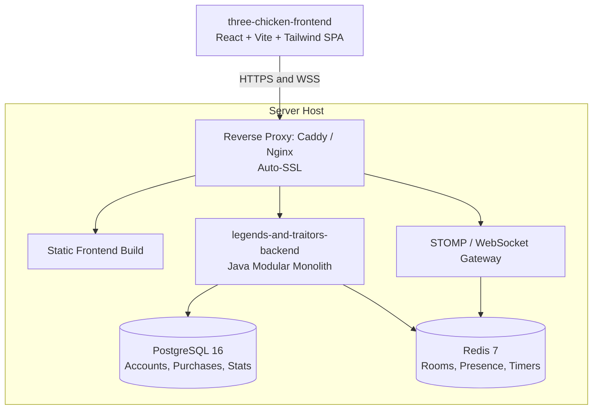

# CLAUDE.md

Guidance for Claude Code when working in `legends-and-traitors-backend`.

> **How to read this file:** facts marked **(repo-verified)** were read from code and must be
> re-checked when the code changes. Facts marked **(spec)** come from design docs and describe
> intended behaviour that may not be built yet.
>
> Game rules, roles, and the epic roadmap live in
> `ai-docs/Three_Chicken_Master_Engineering_Wiki_Context.md`. Story scope and open questions are
> tracked in Taiga (`LT-` tickets) and the Notion engineering wiki — see §1.2.
>
> Companion AI steering for Google Antigravity lives in `AGENT.md` and `.agents/rules/`, adhering
> to this file as the unified Single Source of Truth (SSoT).

---

## 1. Project Overview

- **Project**: Three Chicken (working title *Legends and Traitors*)
- **This repo**: `legends-and-traitors-backend` — Java modular monolith, server-authoritative
- **Companion repo**: `three-chicken-frontend` — React 18/19 + Vite + TypeScript + TailwindCSS,
  Zustand (WS/session state), Framer Motion (card animations), Howler.js (audio),
  `@stomp/stompjs` client with auto-reconnect
- **Genre**: Real-time multiplayer social deduction + tactical turn-based card battle
- **Inspirations**: *Bang!*, *SanGuoSha (Legends of the Three Kingdoms)*, *Werewolf/Mafia*

### 1.1 Core Loop (spec)

1. Players enter a lobby (guest or registered) via room code or direct URL.
2. Server distributes 4 secret roles; the King's identity is publicly revealed.
3. Draft phase — each player selects a historical/mythological Hero.
4. Clockwise real-time turn combat: Attacks, Spells, Equipment, Healing.
5. Targeted players get a tight **10–15s response window** to react (*Dodge*, *Medicine*).
6. Match ends when King/Loyalists, Rebels, or the solo Spy meet victory conditions.

Full rules — roles, victory matrix, draft, card types, turn cycle:
`ai-docs/Three_Chicken_Master_Engineering_Wiki_Context.md` §2.

### 1.2 External Resources

- **Miro planning board**: https://miro.com/app/board/uXjVHtdGyfY=/ (game design canvas)
- **Project tracker**: https://taiga.io — agile scrum epics & user stories (`LT-` ticket IDs)
- **Engineering wiki**: Notion — source of truth for epics and specs

### 1.3 Non-Functional Targets (spec)

- Real-time board-state propagation to all clients: **< 1.0s**
- High-concurrency WebSocket sessions served on **virtual threads**, not blocking kernel threads

---

## 2. Tech Stack

| Component | Technology | Version | Notes |
| --- | --- | --- | --- |
| Language | Java | **21 LTS** (repo-verified: `java.version=21`) | Virtual Threads, strict typing for card mechanics |
| Framework | Spring Boot | **4.1.1** (repo-verified: parent POM) | Design docs say "3.x/4.x"; the POM pins 4.1.1 |
| Primary DB | PostgreSQL | 16-alpine (repo-verified) | Accounts, credentials, $1 upgrade transactions |
| Cache / real-time | Redis | 7-alpine (repo-verified) | Room state, presence, session TTLs |
| Real-time gateway | **STOMP** over Spring WebSocket | starter present (repo-verified); broker not yet configured | Lobby sync, action alerts, live action log — see §5.2 |
| Persistence | Spring Data JPA | via starter (repo-verified) | `open-in-view: false` on every profile |
| Build | Apache Maven | wrapper `./mvnw` (repo-verified) | Maven 3.9+ |
| Codegen | Lombok | optional dep + annotation processor paths (repo-verified) | `@Getter`/`@Setter` used in config classes |

Test starters present (repo-verified): `data-jpa-test`, `data-redis-test`, `webmvc-test`,
`websocket-test`.

**Maven coordinates** (repo-verified): `com.seproduction:legends-and-traitors-backend:0.0.1-SNAPSHOT`

Profiles and the full `game.room.*` / `security.jwt` property matrix live in
`src/main/resources/application{,-dev,-test,-prod}.yml`, bound by `config/GameRoomProperties.java`
and `config/JwtProperties.java`. Read those rather than trusting a copy of the values.

---

## 3. Commands

```bash
# Start local PostgreSQL 16 + Redis 7
docker compose -f docker-compose.dev.yml up -d

# Run the app (defaults to the dev profile)
./mvnw spring-boot:run

# Build / test
./mvnw clean test --batch-mode
./mvnw clean package

# Run against a non-default profile
./mvnw spring-boot:run -Dspring-boot.run.profiles=test
```

On Windows PowerShell use `.\mvnw.cmd` in place of `./mvnw`; the POSIX wrapper works in Git Bash,
WSL, and CI.

**Local ports** (repo-verified from `docker-compose.dev.yml` + `application.yml`):

| Service | Address | Credentials |
| --- | --- | --- |
| Spring Boot app | `http://localhost:8080` | — |
| PostgreSQL 16 | `localhost:5432` | db `three_chicken`, user `dev`, password `devpassword` |
| Redis 7 | `localhost:6379` | — |

Containers are named `tc-postgres-dev` / `tc-redis-dev`; both have healthchecks and named volumes
(`postgres_data`, `redis_data`). **Tests require both to be running.**

---

## 4. Architecture — ADR-001: Progressive Feature-First

**Status:** Approved 2026-09-07 by Backend Engineering Team + Platform Lead.
**Base package (canonical):** `com.seproduction.legendsandtraitors` (repo-verified).

### 4.1 The Rule: "Start Flat, Layer As It Grows"

A feature package starts **flat** (all its files directly inside the domain package). It is broken
into the standard sub-packages only once complexity justifies it. This deliberately avoids empty
folder boilerplate in young features.

### 4.2 Refactoring Triggers — sub-layer when ANY of these hit

1. **File-count threshold** — the feature exceeds **5–7 files**.
2. **Dual-protocol trigger** — the feature has **both** REST endpoints and WebSocket handlers.
3. **Model complexity** — entities plus multiple request/response DTOs need their own `model/`
   sub-package.

### 4.3 Standard Sub-Package Names (use these exact names, always)

| Sub-package | Holds |
| --- | --- |
| `controller/` | REST endpoints |
| `handler/` | STOMP message controllers (`@MessageMapping`) and WS event payloads |
| `service/` | Business rules |
| `repository/` | Persistence (JPA or Redis) |
| `model/` | Entities and DTOs |

### 4.4 Inter-Feature Boundary Rules (strict)

- Features talk to each other **only** through public **service interfaces** or **IDs/DTOs**.
- **Never** import another feature's repositories or internal entities directly.
- Prefer Java **package-private** visibility for a feature's internal components.

### 4.5 Package Layout

Three global packages sit beside the feature packages:

| Package | Holds |
| --- | --- |
| `config/` | Global Spring beans and `@ConfigurationProperties` classes |
| `common/` | Shared utils, base exceptions, global error handlers |
| `security/` | JWT filters, security context helpers |

Every other package is a **feature**, shaped by its current stage:

```
com.seproduction.legendsandtraitors/
├── LegendsAndTraitorsBackendApplication.java
│
├── config/  common/  security/       <-- Global, always present
│
├── <feature>/                        <-- Stage 1: flat, all files in the package
│   ├── <Feature>Controller.java
│   ├── <Feature>Service.java
│   ├── <Entity>.java
│   └── <Entity>Repository.java
│
└── <feature>/                        <-- Stage 2: sub-layered once a §4.2 trigger fires
    ├── controller/
    ├── handler/
    ├── service/
    ├── repository/
    └── model/
```

A feature moves from Stage 1 to Stage 2 in place — same package, files relocated into the §4.3
sub-packages. Never create a sub-package before its trigger fires.

The live tree is `src/main/java/com/seproduction/legendsandtraitors/` — read it for the current set
of feature packages before adding one.

---

## 5. API & WebSocket Contracts (spec)

### 5.1 REST

| Endpoint | Purpose |
| --- | --- |
| `POST /api/auth/guest` | Ephemeral guest session |
| `POST /api/auth/register` | Register account |
| `POST /api/auth/login` | Login |
| `POST /api/rooms` | Create a lobby room (`Authorization: Bearer <token>`) |
| `POST /api/billing/webhook` | Payment provider webhook |

```jsonc
// POST /api/auth/guest → 200
{ "token": "...", "user": { "id": "guest_948201", "displayName": "Guest948201",
                            "isGuest": true, "isPremium": false } }

// POST /api/rooms  { "maxPlayers": 8 } → 201
{ "roomCode": "WXYZ89", "joinUrl": "http://localhost:5173/lobby/WXYZ89",
  "hostId": "guest_948201" }
```

### 5.2 WebSocket — STOMP over Spring WebSocket

**Transport decision (2026-09-10):** STOMP, via `@EnableWebSocketMessageBroker`. This supersedes the
raw `/ws/lobby/{roomCode}` handler described in the Sprint 1 baseline. Candidate for **ADR-002**.

**Broker setup**

| Setting | Value |
| --- | --- |
| STOMP endpoint | `/ws` — single endpoint; the room is no longer in the connect URL |
| Application prefix | `/app` — client → server |
| Broker prefix | `/topic` — server → room broadcast |
| User prefix | `/user` — server → single player |
| Broker | Simple in-memory broker. Scaling past one node requires a relay (RabbitMQ/ActiveMQ). |

**Authentication.** The JWT travels in the **CONNECT frame** (`Authorization: Bearer <token>`),
validated by a `ChannelInterceptor` on the inbound channel, which binds the `Principal`. This is what
makes `/user/**` destinations and message-level security work, and is the main reason to adopt
STOMP — do **not** fall back to authenticating inside the first application message.

**Client → Server (`/app`)**

| Destination | Payload | Notes |
| --- | --- | --- |
| `/app/lobby/{roomCode}/join` | `{ displayName, color }` | Token comes from CONNECT, not the body |
| `/app/lobby/{roomCode}/ready` | `{ isReady }` | |
| `/app/lobby/{roomCode}/chat` | `{ message }` | |
| `/app/lobby/{roomCode}/roles` | `{ roles: { king, loyalist, rebel, spy } }` | Host only |
| `/app/lobby/{roomCode}/start` | — | Host only; requires `canStart` |

`canStart` must be evaluated against injected `GameRoomProperties`, **not** a hardcoded 4–8 range:
`min-players` is overridden to **2** in dev/test, and premium rooms raise `max-players` to **10**.

**Server → Client**

| Destination | Event | Contents |
| --- | --- | --- |
| `/topic/lobby/{roomCode}` | `ROOM_STATE_UPDATED` | roomCode, hostId, minPlayers, maxPlayers, allReady, canStart, players[], roleConfig |
| `/topic/lobby/{roomCode}` | `CHAT_MESSAGE` | senderId, senderName, senderColor, message, ISO timestamp |
| `/topic/lobby/{roomCode}` | `GAME_STARTED` | roomCode, turnPlayerId |
| `/topic/lobby/{roomCode}` | `GAME_LOG_ENTRY` | id, timestamp, actorName, actionType, cardName, targetName, description |
| `/user/queue/alerts` | `ACTION_ALERT` | prompt, timeLimitSeconds, allowedResponses — delivered only to the target player |

Clients subscribe to `/topic/lobby/{roomCode}` plus `/user/queue/alerts` after CONNECT.

**Payload bodies are unchanged** from the Sprint 1 contract — only routing and auth move. The
`event` discriminator is redundant under STOMP (the destination already routes) but is retained in
broadcast bodies so existing frontend switch logic keeps working.

**Deltas from the Sprint 1 baseline**

| Baseline | Under STOMP |
| --- | --- |
| Connect `/ws/lobby/{roomCode}` | Connect `/ws`, then subscribe `/topic/lobby/{roomCode}` |
| Auth in first `JOIN_ROOM` payload | Auth in CONNECT frame header |
| `ACTION_ALERT` broadcast carrying `targetPlayerId` | Sent to `/user/queue/alerts`; no broadcast, no client-side filtering |
| `{ "action": ... }` discriminator | Action encoded in the destination |
| Native browser `WebSocket` | `@stomp/stompjs` client |

> This section is **not yet ratified with the frontend team** — confirm the destinations, the
> CONNECT auth header, and the `/user/queue/alerts` routing with the `three-chicken-frontend` team
> before coding against it.

---

## 6. System Topology



Routing: `/` → static frontend build, `/api/*` → backend, `/ws/*` → STOMP gateway.

CI lives in `.github/workflows/backend-ci.yml`; the epic roadmap is
`ai-docs/Three_Chicken_Master_Engineering_Wiki_Context.md` §6 plus Taiga. Branch naming follows the
existing git history: `<type>/LT-<id>/<short-description>`.

---

## 7. Code Style

### 7.1 Comments — short and rare

**Do not write a lot of comments.** Default to none: clear names and small methods carry the
meaning. When a comment genuinely earns its place, make it **one short line**.

Write a comment only when it says something the code cannot:

- a non-obvious **why** — a chosen constant, a workaround, an ordering that matters
- a **caveat** that would otherwise bite a caller — race window, best-effort guarantee, TTL
- brief **Javadoc** on a public service method whose contract the signature does not already state

Do not write:

- comments that restate the line below them (`// increment the counter`)
- section banners, decorative separators, `// --- getters ---` dividers
- commented-out code — delete it, git remembers
- per-field prose on DTOs, entities and config classes when the field name already says it
- step-by-step narration of an obvious method body

Tests follow the same rule: `@DisplayName` already describes the case, so a comment above the
assertion usually just repeats it.

Files written before this rule carry longer Javadoc. Trim opportunistically when you are already
editing them — do not open a sweep just to remove comments.
