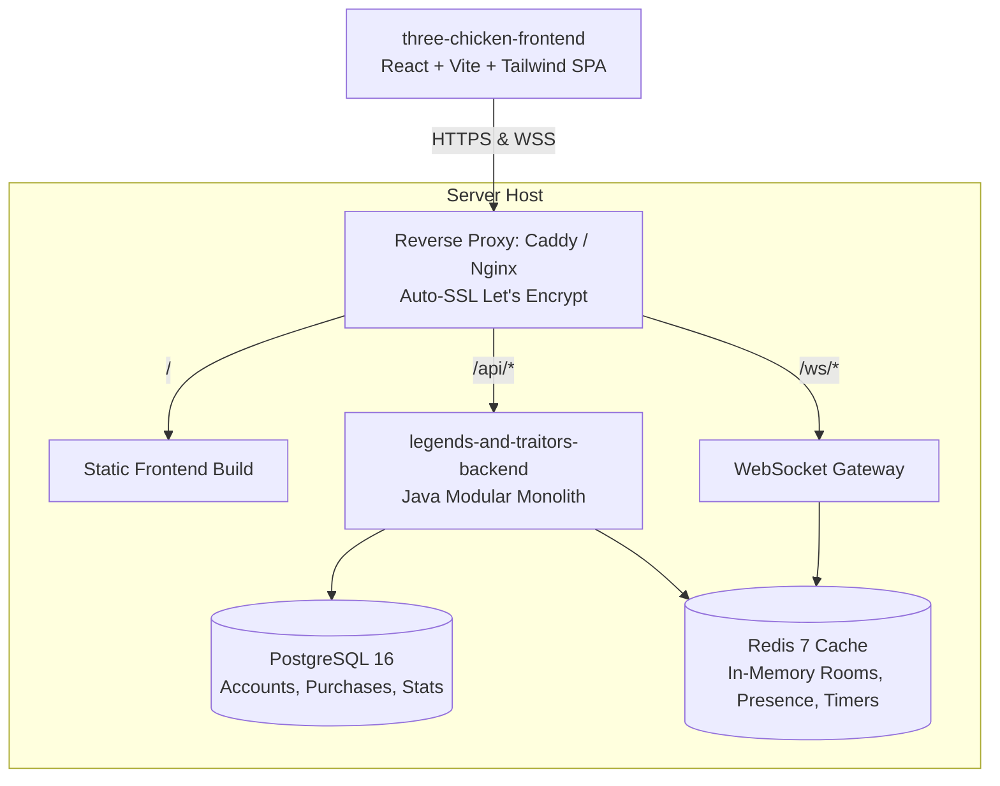

# 🍗 Master Engineering & Product Wiki: Three Chicken (Legends & Traitors)

> **Context Notice**: This document serves as the unified single source of truth (SSoT) for the **Three Chicken** (`legends-and-traitors-backend` / `three-chicken-frontend`) project. It encapsulates game design specifications, system architecture, API/WebSocket contracts, local infrastructure, and agile scrum planning for importing into an engineering wiki (e.g., Notion).

---

## 1. Project Overview & Vision

### 1.1 Summary
* **Project Name**: Three Chicken (Working title: *Legends and Traitors*)
* **Genre**: Real-Time Multiplayer Social Deduction & Tactical Turn-Based Card Battle
* **Inspirations**: *Bang!*, *SanGuoSha (Legends of the Three Kingdoms)*, *Werewolf/Mafia*
* **Core Loop**:
  1. Players enter a lobby (guest or registered) via room code or direct URL.
  2. The game server distributes 4 secret roles; the King's identity is publicly revealed.
  3. Players participate in a draft phase to select their historical/mythological Hero.
  4. Real-time clockwise turn combat begins. Players play Attacks, Spells, Equipment, and Healing.
  5. Targeted players enter tight 10–15s response windows to play reactions (*Dodge*, *Medicine*).
  6. The game concludes when victory conditions for King/Loyalists, Rebels, or the Solo Spy are met.

### 1.2 Core External Links & Resources
* **Miro Planning Board**: [Three Chicken Game Design Canvas](https://miro.com/app/board/uXjVHtdGyfY=/)
* **Project Tracker**: [Taiga.io](https://taiga.io) (Agile Scrum Epics & User Stories)
* **Backend Repository**: `legends-and-traitors-backend` (Java 21, Spring Boot 4/3, Redis, PostgreSQL)
* **Frontend Repository**: `three-chicken-frontend` (React, Vite, TailwindCSS, Zustand, Framer Motion)

---

## 2. Game Mechanics & Design Specification (GDD)

### 2.1 The 4 Secret Roles & Victory Matrix
The game balances asymmetric information. All roles are secret except the King.

| Role | Visibility | Primary Objective | Allies |
| :--- | :--- | :--- | :--- |
| **King (👑)** | **Publicly Revealed** at match start | Eliminate all Rebels and the Spy | Loyalist(s) |
| **Loyalist (🛡️)** | **Hidden** | Protect the King; eliminate all Rebels and Spy | King & Loyalists |
| **Rebel (🗡️)** | **Hidden** | Eliminate the King at all costs | Other Rebels |
| **Spy (🕵️)** | **Hidden** | Survive until the end, eliminate all others, defeat King last in 1v1 | Solo (Plays both sides) |

#### Victory Determination
* **King & Loyalists Win**: All Rebels and Spies are eliminated while the King remains alive.
* **Rebels Win**: The King dies, **unless** the Spy is the sole remaining living player.
* **Spy Wins**: The King is eliminated and the Spy is the **sole remaining player alive** on the field.

### 2.2 Character Draft Phase
Occurs before Turn 1 to determine player health pool and passive/active abilities:
* **King Draft**: Draws **5 Character Cards**, selects **1**, returns 4 to the character deck.
* **Other Players Draft**: Draw **3 Character Cards**, select **1**, return 2 to the deck.
* **Rosters & Factions**:
  * **Faction Warrior**: Leonidas (Spartan shield/defense), Odysseus (tactics/cunning), Alexander the Great (aggression/extra attacks), Genghis Khan (mounted assault/card pressure), Jack the Ripper (assassination), Joan of Arc (inspiration/defense).
  * **Faction Scientist**: Hippocrates of Kos (healing/medicine synergy).
  * **Expansion (DLC Deck)**: Premium hero roster unlocked via the $1 permanent upgrade.

### 2.3 Card Categories & Action Mechanics
The action deck consists of 6 primary card types:
* **⚔️ Attack**: Target a player within range to inflict 1 damage. Triggers an Action Alert.
* **🛡️ Dodge**: Counteracts an incoming Attack card during the response window.
* **💊 Medicine**: Restores 1 HP. Can be played on turn or triggered as a life-saving reaction when HP drops to 0.
* **🍖 Food**: Recovery and sustenance buffs.
* **✨ Spell**: Tactical plays (disarms, card steals, area-of-effect damage, duels).
* **🛡️ Equipment**: Weapons (increase range/attacks), Armor (damage reduction), Mounts (distance modification).

### 2.4 Turn Cycle & Response Windows
1. **Draw Phase**: Active player draws 2 cards from deck.
2. **Action Phase**: Active player plays cards (Attacks, Spells, Equipment).
3. **Response Prompt (Action Alert)**:
   * When an Attack is played, the target receives an interactive HUD modal: `[Play Dodge]` or `[Pass / Take Damage]`.
   * Server runs a **10–15 second countdown timer**.
   * If the timer expires or player passes, damage applies.
   * If HP hits 0, a secondary response prompt opens: `[Use Medicine?]`.
4. **Discard Phase**: Hand size must not exceed current HP at turn end.

---

## 3. User Experience & HUD Layout

```
┌────────────────────────────────────────────────────────────────────────┐
│                        ACTIVE GAME TABLE ARENA                         │
│                                                                        │
│    [Opponent 1 (King 👑)]     [Opponent 2]          [Opponent 3]       │
│    • HP: ♥♥♥♥                 • HP: ♥♥♥             • HP: ♥♥           │
│    • Cards: 3 | Equip: 1      • Cards: 4 | Equip: 0 • Cards: 2 | Equip: 2│
│    (Click badge to inspect)   (Active Turn Border)                     │
│                                                                        │
│ ────────────────────────────────────────────────────────────────────── │
│ 📜 GAME ACTION LOG (Live)              💬 IN-GAME CHAT                 │
│ [14:02] Leonidas played Attack -> Ody  Leonidas: "Protect the King!"   │
│ [14:03] Odysseus played Dodge (Evaded)                                 │
│ ────────────────────────────────────────────────────────────────────── │
│ 👤 YOUR DASHBOARD (Always Visible without clicks)                      │
│ • Character: Leonidas (Warrior) [Skill: Spartan Shield - Passive]       │
│ • Health: ♥♥♥♥♥                                                        │
│ • Equipped: [Spear of Sparta (+1 Range)] [Iron Armor]                  │
│ • Hand Cards: [Attack ⚔️] [Dodge 🛡️] [Medicine 💊] [Spell ✨]          │
└────────────────────────────────────────────────────────────────────────┘
```

* **Zero-Click Self Information**: Hand cards, equipment, hero portrait, role card, and HP are always visible.
* **Opponent State Badges**: Shows public health, card count, and equipment count. Clicking opens an **Inspection Modal** showing their equipped items and hero ability descriptions.
* **Real-Time Action Log**: Chronological scroll area detailing all attacks, reactions, and phase events.
* **Latency SLA**: Real-time board state propagation < 1.0s.

---

## 4. Platform Architecture & Tech Stack

### 4.1 System Topology


### 4.2 Multi-Repo Strategy
* **Backend Repository**: `legends-and-traitors-backend`
  * Java 21 LTS + Spring Boot 3.x/4.x
  * Virtual Threads (`spring.threads.virtual.enabled=true`) for high-concurrency WebSocket connections
  * Spring Data JPA (PostgreSQL 16) for persistent accounts and $1 transaction logs
  * Spring Data Redis (Redis 7) for real-time room sessions, presence, and pub/sub
  * Docker Compose (`docker-compose.dev.yml`) for instant local environment boot
* **Frontend Repository**: `three-chicken-frontend`
  * React 18/19 + Vite + TypeScript
  * TailwindCSS for rapid game board and badge layout
  * Framer Motion for card dealing, discarding, and flip animations
  * Zustand for client-side WebSocket and session state
  * Howler.js for card audio, attack sounds, and countdown ticking
  * Native WebSocket client with auto-reconnect logic

### 4.3 Accounts & Monetization Model
* **Guest Access**: Zero registration. Instantly generates handle `Guest<6-digit>` and temporary JWT.
* **Registered Accounts**: Username/email + password (hashed with Argon2/BCrypt), 6-digit email passcode verification, password reset links.
* **Monetization**:
  * $1.00 Permanent Lifetime Upgrade.
  * Benefits: Expands room capacity from 8 to **10 players** and unlocks the **DLC Character Deck**.

---

## 5. API & WebSocket Contracts

### 5.1 REST Endpoints
* **`POST /api/auth/guest`**: Creates ephemeral guest session.
  * Response: `{ "token": "...", "user": { "id": "guest_948201", "displayName": "Guest948201", "isGuest": true, "isPremium": false } }`
* **`POST /api/rooms`**: Creates a new lobby room.
  * Header: `Authorization: Bearer <TOKEN>`
  * Request: `{ "maxPlayers": 8 }`
  * Response (201): `{ "roomCode": "WXYZ89", "joinUrl": "http://localhost:5173/lobby/WXYZ89", "hostId": "guest_948201" }`

### 5.2 WebSocket Protocol (`/ws/lobby/{roomCode}`)

#### Client Actions $\rightarrow$ Server:
1. `JOIN_ROOM`: `{ "action": "JOIN_ROOM", "token": "...", "displayName": "Leonidas", "color": "#E53E3E" }`
2. `TOGGLE_READY`: `{ "action": "TOGGLE_READY", "isReady": true }`
3. `SEND_CHAT`: `{ "action": "SEND_CHAT", "message": "Protect the King!" }`
4. `UPDATE_ROLES`: `{ "action": "UPDATE_ROLES", "roles": { "king": 1, "loyalist": 2, "rebel": 4, "spy": 1 } }`
5. `START_GAME`: `{ "action": "START_GAME" }`

#### Server Broadcasts $\rightarrow$ Client:
1. `ROOM_STATE_UPDATED`: Full room roster, host identity, ready states, role distributions, start eligibility.
2. `CHAT_MESSAGE`: Sender ID, name, avatar color, message text, ISO timestamp.
3. `GAME_STARTED`: Signals client to transition from lobby waiting room to game arena.
4. `GAME_LOG_ENTRY`: Structured payload for the on-screen action log (actor, target, card, narrative description).
5. `ACTION_ALERT`: Target player ID, prompt message, timeout in seconds, and allowed action buttons (`["DODGE", "PASS"]`).

---

## 6. Scrum Roadmap & Epic Breakdown

### 6.1 Epics (Source of Truth: Notion Engineering Wiki & Taiga.io)
* **Epic 1: 🚪 Lobby and Room** (6 Stories: Guest Join, Create Lobby, Start Game, Lobby Setting, Display Name, AFK) — *Goal: Get players into a room, configure lobby, set names/readiness, and trigger start.*
* **Epic 2: 🔁 Turn loop** (6 Stories: Deck, Draw Cards, Discard Pile, Game Start & Setup, Turn Phases, Take & End Turn) — *Goal: Server-authoritative walking skeleton cycling through 6 phases and deck operations.*
* **Epic 3: 🃏 Card play and resolution** (6 Stories: Play Targeted Attack, Respond with Dodge [Keystone], Take Damage, Play Self-Heal, Reject Illegal Moves, Judgement) — *Goal: Card mechanics, response window countdowns, damage, and heals.*
* **Epic 4: 💀 Death and victory** (3 Stories: Brink of Death, Player Death & Role Reveal, Win Condition & Results) — *Goal: 0-HP saving window, role reveals, and victory matrix evaluation.*
* **Epic 5: 👤 Account** (5 Stories: Register, Login, Logout, Reset Password, Verify Email) — *Goal: Persistent user identity and credentials.*
* **Epic 6: 📡 Real time sync** (5 Stories: Live Update, State of Game, Game Log, Disconnect, Rejoin) — *Goal: Real-time WebSocket state push (<1.0s), disconnect, and reconnect.*
* **Epic 7: 💎 Premium purchase** (2 Stories: Premium Purchase, Premium Benefit) — *Goal: $1 lifetime upgrade, 10-player room capacity expansion, and DLC deck access.*

### 6.2 Priority Distribution (33 Total Stories)
* **Must (21 stories)**: Core playable game loop (Lobby, Turn Loop, Card Resolution, Death & Victory, Real-time Sync).
* **Should (8 stories)**: Lobby settings, AFK, Account management, Game log, Rejoin.
* **Nice to have (4 stories)**: Display name, Judgement, Premium purchase, Premium Benefit.

### 6.3 Technical Spikes & Edge-Case Decisions
* **Spike 1 (Response Timers)**: Server-side `ScheduledExecutorService` creates a 10–15s window. If disconnected or timed out, auto-resolves to "Pass / Take Damage".
* **Spike 2 (Disconnect Rule)**: Disconnected players cannot reconnect. On disconnect (>5s grace), player is eliminated, hand is discarded to graveyard, and victory conditions are evaluated immediately.
* **Spike 3 (DLC Deck Injection)**: Card pools are defined via JSON (`base_deck.json` and `dlc_deck.json`). If any player in the room is premium, the DLC character pool is merged into the draft generator.
